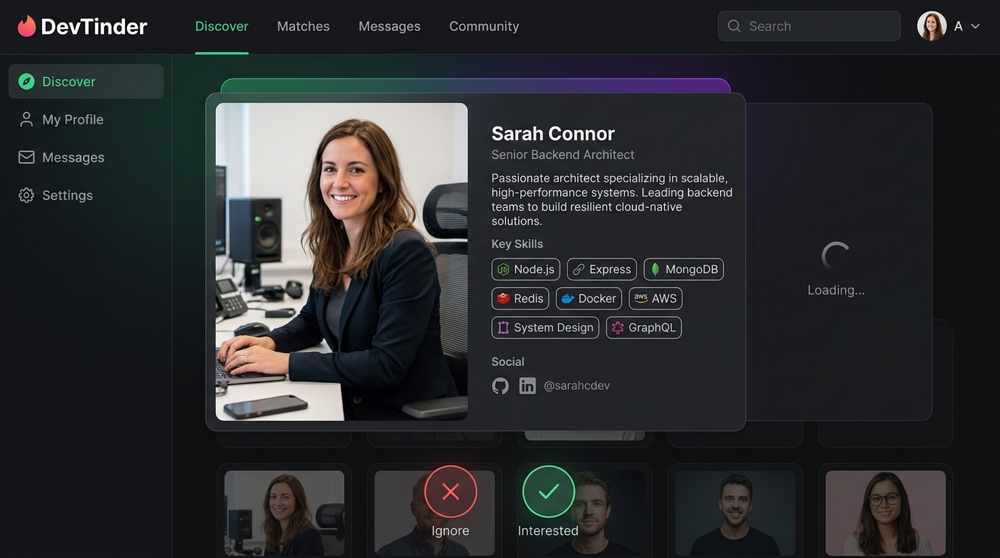
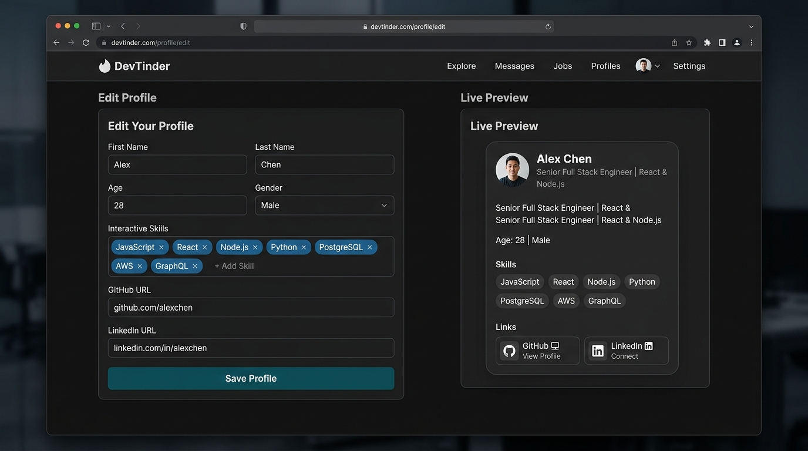
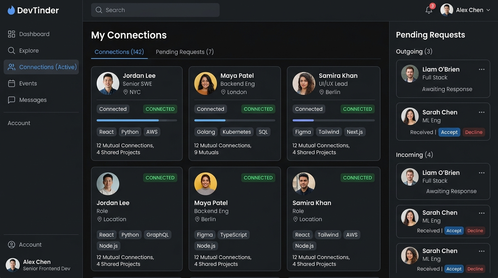

# 🔥 DevTinder - Minor Project

<div align="center">


**A Modern MERN-Stack Developer Networking & Matching Platform**

[](https://react.dev/)
[](https://nodejs.org/)
[](https://expressjs.com/)
[](https://www.mongodb.com/atlas)
[](https://tailwindcss.com/)
[](https://daisyui.com/)
[](LICENSE)

[Features](#-key-features) • [Screenshots](#-screenshots--ui-preview) • [Tech Stack](#-tech-stack) • [Installation](#-getting-started) • [API Docs](#-api-endpoints) • [Deployment](#-deployment-guide)

</div>

---

## 📖 Overview

**DevTinder** is a dedicated matchmaking and professional networking web application designed exclusively for software developers and tech enthusiasts. Inspired by modern swipe-based networking, DevTinder helps developers discover peers, collaborate on projects, exchange connection requests, and connect directly across their GitHub, LinkedIn, and social profiles.

---

## ✨ Key Features

- 🎯 **Interactive Developer Discovery Feed**
  - Clean, swipeable developer cards showing real-time profiles with bio, age, gender, and skills.
  - Quick action buttons: **Interested** (Send Request) and **Ignore**.
  - Intelligent feed filtering: hides yourself, existing connections, and already-sent requests.

- 👥 **Connection Requests & Network Management**
  - **Pending Requests:** View incoming connection requests from other developers with one-click **Accept** or **Reject** actions.
  - **My Connections:** Browse all accepted developer connections with direct links to their developer profiles.

- 🛠️ **Rich Profile Customization & Live Preview**
  - **Photo Upload:** Upload profile images directly from local device storage with automatic Base64 encoding.
  - **Interactive Skills Selector:** Add or remove technical skills with intuitive badge tags and keyboard shortcuts (`Enter` / comma).
  - **Direct Social Integration:** One-click links to GitHub, LinkedIn, and Twitter profiles with intelligent URL normalization (handles `@username`, raw handles, and custom URLs).
  - **Real-time Live Preview:** Instant side-by-side preview showing how your developer card appears to others.

- 🔐 **Secure Authentication & Session Management**
  - Secure user signup and login with email and strong password validation.
  - Industry-standard **bcrypt** password hashing.
  - Stateless authentication with signed **JSON Web Tokens (JWT)** stored in secure, `httpOnly` cookies.

---

## 📸 Screenshots & UI Preview

### 1. Developer Discovery Feed
Explore other developers, view their technical skills, and send connection requests with a single click.



---

### 2. Profile Editor & Real-Time Live Preview
Edit bio, age, gender, skills, GitHub, and LinkedIn links with an instant side-by-side live card preview.



---

### 3. Connections & Requests Management
Manage your professional developer network and respond to incoming connection requests.



---

## 💻 Tech Stack

### Frontend
| Technology | Purpose |
| :--- | :--- |
| **React 19** | Dynamic, reactive single-page user interface |
| **Vite** | Blazing-fast frontend build tooling |
| **Redux Toolkit** | Centralized state management for user, feed, connections, and requests |
| **React Router v7** | Declarative client-side routing |
| **Tailwind CSS & DaisyUI** | Modern dark-themed utility-first UI styling |
| **Axios** | HTTP client with automatic cookie credential handling |

### Backend
| Technology | Purpose |
| :--- | :--- |
| **Node.js** | Server-side JavaScript runtime |
| **Express.js 5** | Modular RESTful API architecture |
| **MongoDB Atlas & Mongoose** | Cloud NoSQL database with schema validation & indexing |
| **JSON Web Tokens (JWT)** | Token-based authentication |
| **bcrypt** | Salted cryptographic password hashing |
| **Cookie-Parser** | Secure cookie extraction and validation |
| **CORS** | Cross-Origin Resource Sharing with credentials support |

---

## 📁 Project Structure

```text
DevTinder-Minor-Project/
├── assets/                          # Preview images and UI screenshots
│   ├── devtinder_banner.jpg
│   ├── feed_preview.jpg
│   ├── profile_edit.jpg
│   └── connections_preview.jpg
│
├── DevTinder-Frontend/              # Client Application (React + Vite)
│   ├── src/
│   │   ├── components/              # UI Components (Feed, Profile, Navbar, etc.)
│   │   ├── utils/                   # Redux store, slices, and URL helpers
│   │   ├── App.jsx                  # Root application router
│   │   └── main.jsx                 # Client entry point
│   ├── public/                      # Static assets & icons
│   ├── vercel.json                  # Vercel SPA routing configuration
│   └── package.json
│
├── DevTinder-backend/               # RESTful API Server (Node.js + Express)
│   ├── src/
│   │   ├── config/                  # Database connection (MongoDB Atlas)
│   │   ├── controllers/             # Request handling logic
│   │   ├── middlewares/             # JWT authentication middleware
│   │   ├── models/                  # Mongoose models (User, ConnectionRequest)
│   │   ├── routes/                  # Express routes (auth, profile, request, user)
│   │   ├── utils/                   # Validation schemas & helpers
│   │   └── app.js                   # Express application entry point
│   ├── render.yaml                  # Render deployment blueprint
│   └── package.json
│
├── .gitignore                       # Root Git ignore (protects .env & node_modules)
└── README.md                        # Documentation
```

---

## 🚀 Getting Started

### Prerequisites
- **Node.js**: v18 or higher ([Download Node.js](https://nodejs.org/))
- **MongoDB Atlas** account or a local MongoDB instance ([MongoDB Atlas](https://www.mongodb.com/cloud/atlas))
- **Git** ([Download Git](https://git-scm.com/))

---

### Step 1: Clone the Repository
```bash
git clone https://github.com/ArpitaMandloi/DevTinder-Minor-Project.git
cd DevTinder-Minor-Project
```

---

### Step 2: Backend Setup
1. Navigate to the backend directory:
   ```bash
   cd DevTinder-backend
   ```
2. Install dependencies:
   ```bash
   npm install
   ```
3. Configure environment variables:
   Create a `.env` file in `DevTinder-backend`:
   ```env
   PORT=7777
   NODE_ENV=development
   MONGO_URI=your_mongodb_atlas_connection_string
   JWT_SECRET=your_super_secret_jwt_key
   CLIENT_URL=http://localhost:5173
   ```
4. Start the backend development server:
   ```bash
   npm run dev
   # Server runs at http://localhost:7777
   ```

---

### Step 3: Frontend Setup
1. Open a new terminal and navigate to the frontend directory:
   ```bash
   cd DevTinder-Frontend
   ```
2. Install dependencies:
   ```bash
   npm install
   ```
3. (Optional) Configure environment variables:
   Create a `.env` file in `DevTinder-Frontend`:
   ```env
   VITE_API_BASE_URL=http://localhost:7777
   ```
4. Start the Vite development server:
   ```bash
   npm run dev
   # App will be accessible at http://localhost:5173
   ```

---

## 📡 API Endpoints

### Authentication (`/auth`)
| Method | Endpoint | Description | Auth Required |
| :--- | :--- | :--- | :---: |
| `POST` | `/signup` | Register a new developer account | No |
| `POST` | `/login` | Authenticate user & receive JWT cookie | No |
| `POST` | `/logout` | Invalidate cookie session | Yes |

### Profile (`/profile`)
| Method | Endpoint | Description | Auth Required |
| :--- | :--- | :--- | :---: |
| `GET` | `/profile/view` | Fetch current logged-in user profile | Yes |
| `PATCH` | `/profile/edit` | Update profile fields (skills, URLs, photo, bio) | Yes |

### Connection Requests (`/request`)
| Method | Endpoint | Description | Auth Required |
| :--- | :--- | :--- | :---: |
| `POST` | `/request/send/:status/:toUserId` | Send request (`interested` or `ignored`) | Yes |
| `POST` | `/request/review/:status/:requestId` | Review request (`accepted` or `rejected`) | Yes |

### User Network & Feed (`/user`)
| Method | Endpoint | Description | Auth Required |
| :--- | :--- | :--- | :---: |
| `GET` | `/user/requests/received` | Fetch all pending incoming requests | Yes |
| `GET` | `/user/connections` | Fetch all active accepted connections | Yes |
| `GET` | `/user/feed` | Fetch discoverable developers for feed | Yes |

---

## 🌐 Deployment Guide

### Frontend Deployment (Vercel)
1. Push your code to GitHub.
2. Sign in to [Vercel](https://vercel.com/) and click **Add New Project**.
3. Import the `DevTinder-Minor-Project` repository.
4. Set **Root Directory** to `DevTinder-Frontend`.
5. Add the Environment Variable:
   - `VITE_API_BASE_URL` = `https://your-backend-service.onrender.com`
6. Click **Deploy**. Vercel will automatically build the project and handle SPA routing via `vercel.json`.

---

### Backend Deployment (Render / Railway)
1. Sign in to [Render](https://render.com/).
2. Create a new **Web Service** and link your GitHub repository.
3. Set **Root Directory** to `DevTinder-backend`.
4. Configure Build and Start commands:
   - **Build Command:** `npm install`
   - **Start Command:** `npm start`
5. Configure Environment Variables in the Render Dashboard:
   - `NODE_ENV`: `production`
   - `PORT`: `7777`
   - `MONGO_URI`: `<Your MongoDB Atlas connection string>`
   - `JWT_SECRET`: `<Your secure random secret>`
   - `CLIENT_URL`: `https://your-frontend-domain.vercel.app`
6. Click **Create Web Service**. Render will deploy your live API endpoint.

---

## 👩‍💻 Author

**Arpita Mandloi**
- GitHub: [@ArpitaMandloi](https://github.com/ArpitaMandloi)
- Project: [DevTinder-Minor-Project](https://github.com/ArpitaMandloi/DevTinder-Minor-Project)

---

## 📄 License

This project is licensed under the [MIT License](LICENSE).
